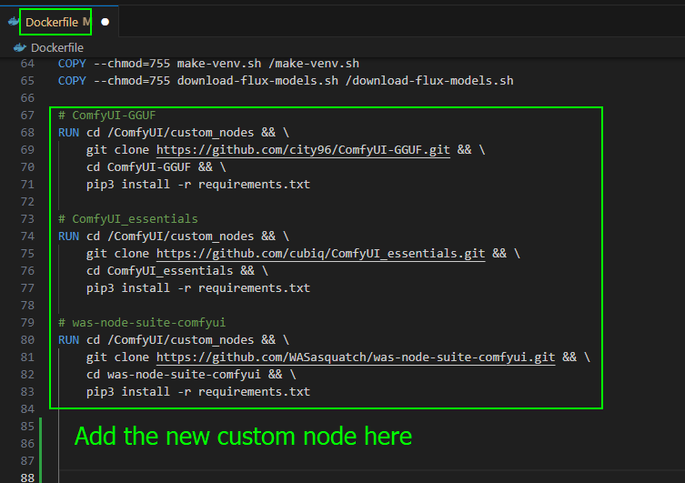
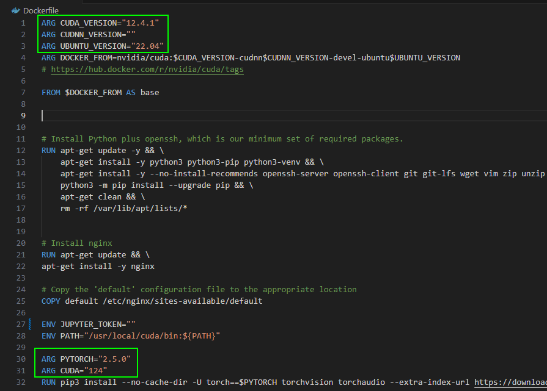
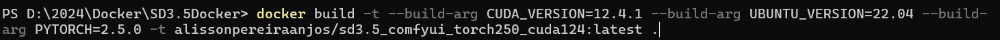

# Overview

This repository contains the base files to create a docker image prepared to run Stable Diffusion 3.5 Large, ComfyUI (with some custom nodes installed), ai-toolkit (to train LoRA) and JupyterLab.

**Note**: The image created from this template can be used in the runpod, the flux, clips and vae models are not embedded in the root of the image. You can do this if you want by creating an image from this one and customizing it so that the templates are included. As it stands currently, you need to run the **download-all.sh** script after creating the container to download the Stable Diffusion, clips, vae... models.

## ComfyUI pre-installed custom nodes

- ComfyUI-GGUF
- ComfyUI_essentials
- was-node-suite-comfyui
- ComfyUI-Florence2
- ComfyUI-Easy-Use
- ComfyUI-Impact-Subpack
- Comfyrol Studio
- KJNodes
- rgthree

# How to build a new image

### 1. Clone this repository
```
git clone https://github.com/alisson-anjos/SD3.5Docker.git
```
### 3. Customize the custom nodes that should be installed (if you want of course)

This can be done by adding or removing one of the existing nodes that are listed inside the Dockerfile.



### 2. Customize CUDA, CUDNN, UBUNTU, PYTORCH version (2 ways to do it)

The first is to change the versions in the Dockerfile



**Note**: if you change CUDA_VERSION, CUDNN_VERSION and UBUNTU_VERSION you need check if this combination exists in this docker hub [nvidia](https://hub.docker.com/r/nvidia/cuda/tags)

The second is to change the versions when building the image



### 4. Building the image

To build a new image you can use the command bellow (remember that you need to have the docker installed on your operationg system)

```
docker build -t [docker username]/[name of your image]:[tag (can use latest)] .
```

Example: 


**Note**: If you want to learn more about docker you can see the documentation here: [Docker Documentation](https://docs.docker.com/reference/cli/docker/)


# Reference

[ValyrianTech](https://github.com/ValyrianTech/ComfyUI_with_Flux)

